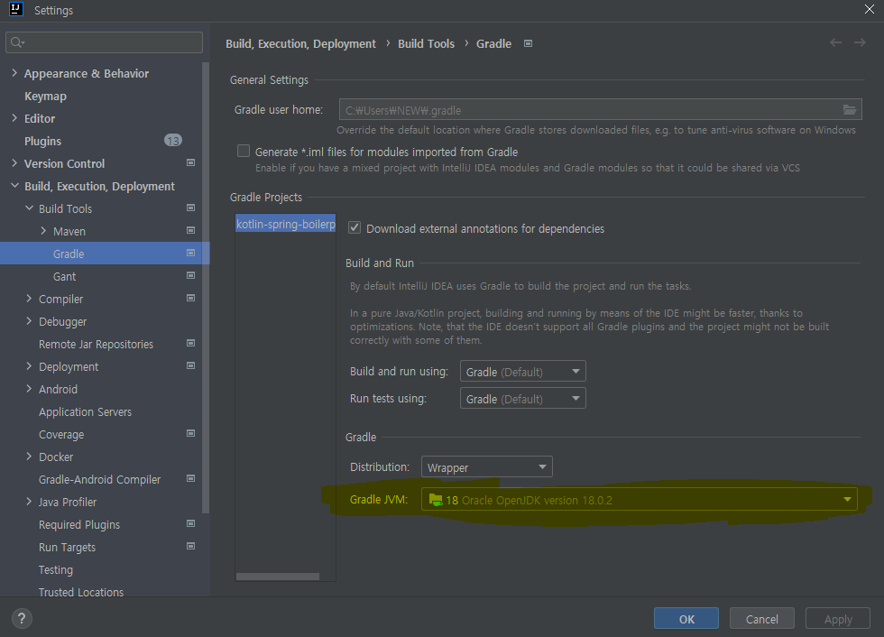

# Kotlin Spring boilerplate

Spring boilerplate based on hexagonal architecture

- Kotlin 1.7.21
- Spring boot 3.0.0
- Querydsl
- Kotest
- Rest docs
- Mockk

### 환경
 - jdk : 17이상
 - gradle설정

### 테스트
 - http/UserV1.http를 통해 사용자 추가 조회 가능
 - 추가할 때 id를 받음.
 - 그 id로 조회하면 name 조회함.
 - http/PostV1.http를 통해 post 추가 가능.
 - 
